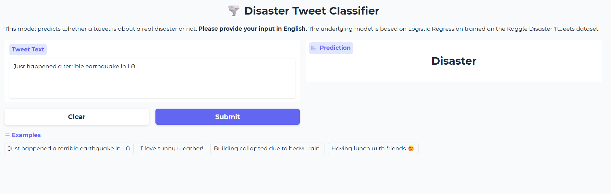
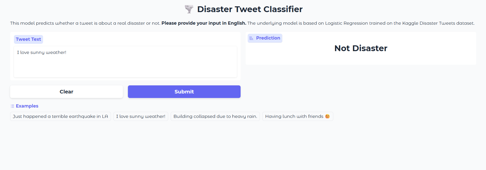

# 🌪️ Disaster Tweet Classifier

This project predicts whether a tweet refers to a real disaster or not. The model is built using Natural Language Processing (NLP) techniques and a Logistic Regression classifier trained on the [Kaggle Disaster Tweets Dataset](https://www.kaggle.com/c/nlp-getting-started/data). It also includes a Gradio web application for easy testing.

---

## 📝 Dataset

The dataset contains 10,000+ tweets that are labeled as either:

- **Disaster** (label = 1): the tweet refers to an actual disaster event.
- **Not Disaster** (label = 0): the tweet is unrelated to a disaster.

Each record has the tweet text and metadata (location, keyword, etc.). For this project, only the text content is used.

---

## 🧠 Model Training

The main steps of the pipeline are:

1. **Text Preprocessing**
   - Removing URLs and special characters
   - Lowercasing
   - Tokenization
   - Stopword removal

2. **Feature Extraction**
   - TF-IDF vectorization of tweet text

3. **Model Selection**
   - Logistic Regression classifier

4. **Training & Evaluation**
   - The dataset was split into training and test sets.
   - After training, the model achieved:
     - **Accuracy**: *Approximately 79%* on the test set.
     - **F1 Score**: *Approximately 0.76*

The trained model was saved as a `.pkl` file under the `model/` directory.

---

## 💾 Model Saving

The trained Logistic Regression model is stored as:

model/
├── model.pkl

This model is loaded later in the Gradio application.

---

## ⚡ Gradio Web Interface

A Gradio interface was created to make predictions easily.  
Users can input any tweet text, and the app will classify it as **Disaster** or **Not Disaster**.

> **Note:** Input text **must be in English**.

Below are example screenshots of the Gradio app:

### Example 1 – Disaster Tweet

### Example 2 – Not Disaster Tweet

---

## 🚀 How to Run

You can either run the notebooks or launch the Gradio app.

### 1️⃣ Train the Model

Open the notebook:

nlp-with-disaster-tweets.ipynb

Run all cells to preprocess data, train the classifier, and save the model.

### 2️⃣ Launch Gradio App

Open:

gradio.ipynb

Run all cells. This will:

- Load the trained model from `model/model.pkl`.
- Launch a Gradio interface in your browser.

---

## 🔍 Example Predictions

Example inputs and their predictions:

| Tweet Text                                      | Prediction     |
|-------------------------------------------------|----------------|
| *Just happened a terrible earthquake in LA*    | **Disaster**   |
| *I love sunny weather!*                        | **Not Disaster** |
| *Building collapsed due to heavy rain.*        | **Disaster**   |
| *Having lunch with friends 😊*                  | **Not Disaster** |

---

## ⚠️ Important Notes

- Input tweets **must be in English** for accurate prediction.
- This project is for educational purposes. Real-world deployments require more robust validation.

---

## 🛠️ Requirements
Typical libraries used:

- scikit-learn
- pandas
- numpy
- gradio

---

## 📂 Project Structure

.
├── model/
│ └── disaster_model.pkl
├── nlp-with-disaster-tweets.ipynb
├── gradio.ipynb
├── images/
│ ├── gradio1.png
│ └── gradio2.png
└── README.md

---

## ✨ Acknowledgments

- [Kaggle NLP Getting Started Competition](https://www.kaggle.com/c/nlp-getting-started)
- scikit-learn documentation
- Gradio for interactive demos

---

Feel free to contribute or customize this project further!
